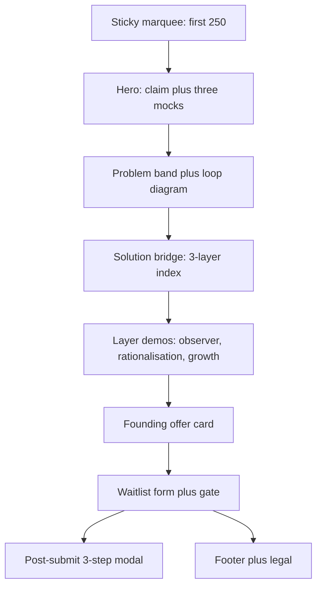

# Waitlist design

**Product:** cognoscene founding waitlist  
**Canonical live page:** [https://gencogno.github.io/cognoscene-waitlist/](https://gencogno.github.io/cognoscene-waitlist/)  
**Production file on `main`:** `index.html` (GitHub Pages)  
**Last updated:** 19 Aug 2026  
**Status:** Part 1 = as-is record of the live page. Part 2 = proposed structure only — not implemented.

This document records **page structure and design behaviour**. It does not replace:

- [`WAITLIST-PLAN.md`](./WAITLIST-PLAN.md) — GTM, offers, email sequence, tracker
- [`HANDOVER.md`](./HANDOVER.md) — agent rules and brand constants
- [`../MOBILE.md`](../MOBILE.md) — mobile implementation plan / phases

---

## How to use this doc

| Part | Use |
|------|-----|
| **1 — As-is** | Design source of truth for what is live on GitHub Pages today |
| **2 — Proposed** | Structure changes filtered by founder constraints. Do not ship until founder signs off |

Quoted strings below are live UI copy (all-lowercase on the page unless noted).

---

# Part 1 — As-is

## 1. Canonical source (do not design from the stale local copy)

The waitlist is hosted on **GitHub Pages** from public repo `gencogno/cognoscene-waitlist`.

| Item | Live (`main` / Pages) | This workspace copy of `index.html` |
|------|------------------------|-------------------------------------|
| `SITE_URL` | `https://gencogno.github.io/cognoscene-waitlist` | `https://cognoscenewaitlist.netlify.app` |
| Cream token | `#edeade` | `#f5f0e8` |
| Lime token | `#b8d878` | `#c8e88a` |
| Hero CTA | `i need this!` | `join the waitlist` |
| Form extras | `i'm joining for` radios (web / mobile / both) | email + two checkboxes only |
| Post-submit | 3-step micro-survey modal (`#psmModal`) | none |
| Problem close | financially-vulnerability wording | `there's nothing to interrupt the urge when it hits…` |
| Solution eyebrow | `the solution · cognoscene` | `cognoscene · the key to the problem` |

**Rule:** iterate and specify against GitHub `main`. Sync this workspace before mockup or production edits, or you will silently target a Netlify-era form.

Handover still lists cream `#F5F0E8` / lime `#C8E88A` and a Chrome y/n field. Those describe an earlier baseline, not the live page. This design doc wins for visual tokens and form structure until handover is updated.

---

## 2. Locked constraints (founder)

These constrain both the as-is job of the page and any Part 2 change.

| Constraint | Detail |
|------------|--------|
| Operator | founder `cogno` (`gencogno`) · `cognoscene@gmail.com` · Singapore · pre-incorporation · pre-revenue |
| Binding capacity | **student founder + NS-limited support** — batches, qualification, and copy must reduce unqualified signups and inbound questions, not maximise list size |
| Product today | desktop **Chrome extension** — observer → 48h rationalisation → growth. Not a mobile app. Native apps = roadmap targeting late 2027 |
| Launch | Singapore-first · email-only · 250 founding spots · 2 months free then **us$10 lifetime** |
| Split | Daniella owns Stripe / backend; founder owns GTM and this page |
| Voice | all-lowercase Buffer-style · identity / prudence · no clinical addiction language · no Telegram · no emojis in docs or commits |
| Legal stance | do not describe cognoscene as Pte Ltd; founding checkout is gated (no public Stripe payment link) |

Page job, given the above:

> Capture a **qualified email** from someone who can install on **desktop Chrome** when their batch opens. Mobile visitors may join; they are not the install surface.

---

## 3. Visual system (live)

### 3.1 Tokens

From live `:root` on GitHub `index.html`:

| Token | Value | Use |
|-------|--------|-----|
| `--cream` | `#edeade` | page background, mobile CTA bar |
| `--cream-2` | `#ebe4d4` | secondary cream |
| `--black` | `#111111` | type, marquee, primary buttons |
| `--mid` | `#4a4f47` | body / lead |
| `--muted` | `#8a8a84` | meta, captions |
| `--line` | `#ddd5c0` | borders |
| `--lime` | `#b8d878` | accent, marquee underline, highlights |
| `--lime-muted` | `#a8c870` | submit button text |
| `--green` | `#3b6d11` | platform radio accent |
| `--danger` | `#c45c4a` | errors |
| `--white` | `#ffffff` | cards, mocks |
| `--serif` | Times New Roman, Times, serif | hero / section headlines |
| `--sans` | Be Vietnam Pro, system-ui, sans-serif | UI and body |
| `--max` | `920px` | `.wrap` |
| `--form-max` | `520px` | form column |

Google Fonts load: `Be Vietnam Pro` 400 / 500 / 800. `text-transform: lowercase` is set on `body`.

### 3.2 Assets (do not substitute)

| Asset | Role |
|-------|------|
| `assets/cognoscene-mark.png` | concentric-ring mark (favicon, hero, mocks) |
| `assets/cognoscene-wordmark.png` | lowercase wordmark — hidden on mobile hero |
| `assets/icons/icon-trap-cart.png` | loop card · you buy it |
| `assets/icons/icon-regret-bag.png` | loop card · you regret it |
| `assets/og-share.png` | Open Graph |

Retired SVG placeholders must not return.

### 3.3 Motion

- Top marquee: 32s linear infinite; disabled under `prefers-reduced-motion`
- Primary / submit / founding card: slight translate on hover (also reduced-motion off)
- Showcase videos: autoplay, muted, loop, `playsinline`
- Scroll-triggered swipe highlight (`.stat-highlight`, `.highlight-swipe`, founding `.fc-swipe`) via IntersectionObserver
- Video lightbox fade (~450ms) when changing slider clips
- Mobile roadmap sheet: slide-up dialog

### 3.4 Type roles

| Role | Treatment |
|------|-----------|
| Hero / section H1–H2 | serif, tight tracking, large clamp |
| Eyebrows | small sans, letter-spacing, muted |
| Body / steps | 15px sans, line-height ~1.65 |
| Buttons | pill, sans 14–16px, black fill, lime text |
| Quotes | distinct blockquote (`"I wasted $78.49 for no reason."` — mixed case inside the quote) |

Breakpoint: **`@media (max-width: 760px)`** for almost all mobile layout. Extra shrink at **380px**. A leftover `.anchor-nav` rule set hides itself at `min-width: 601px`; live scrape did not surface matching nav links — treat as unused CSS unless markup is confirmed on `main`.

---

## 4. Information architecture

Narrative spine on one long page:

**regret claim → see / buy / regret loop → 3 layers of friction → founding scarcity → email capture → optional profiling**

Chrome-only honesty also lives in:

- desktop `.chrome-band` (hidden on mobile)
- mobile hero `(i)` sheet (`#heroRoadmapSheet`)
- how-band footnote + form trust line

---

## 5. Section inventory

### 5.1 Sticky marquee — `.top-bar`

| | |
|--|--|
| **Job** | Scarcity before the brand: only the first 250 get early access |
| **Copy** | `only the first 250 users get early access to cognoscene` (repeated track, lime `◆`) |
| **Visual** | Black bar, lime 3px bottom border, edge fade gradients |
| **Interaction** | Sticky `z-index: 100`. Not a nav. Reduced-motion: static wrap, second track hidden |

### 5.2 Hero — `section.hero`

| | Desktop | Mobile (≤760px) |
|--|---------|------------------|
| **Brand** | Mark + wordmark, centered | Mark only, left-aligned; wordmark hidden |
| **H1** | `98% of your regretful decisions happen pre-purchase.` (`#hero-heading`) | `prevent destructive web-impulse buys.` (`.mobile-h1`) |
| **Sub** | `a chrome extension that pauses impulse buys before you pay.` | `we're building cognoscene… vicious cycle of guilt & overspending.` |
| **Lead** | `you buy to feel good, then the package arrives…` | hidden |
| **Chrome band** | `desktop chrome only — laptop or desktop. not mobile safari or in-app browsers.` | hidden |
| **CTA** | `i need this!` → `#waitlist` | same + 44×44 `(i)` `#heroInfoBtn` |
| **Meta** | `250 early-access spots · 2 months free · us$10 lifetime after` | same, 15px |
| **Visual** | Stacked mocks: growth dashboard / browse pulse / 48h hold | Growth mock hidden; browse + hold overlapping |

Mocks (sample UI, not live product data):

- **Growth:** tabs `home` / `growth`; `prudence streak` 3 weeks without urgente bypass; `6 purchases rationalised`
- **Browse:** `let's take it easy — leave the site if you don't need anything.` · leave site / continue
- **Hold:** `act with prudence — checkout paused.` · `48 hours to decide with intention.` · live-looking `48:00:00` timer
- Tag: `sample ui · growth · browse · hold`

**Mobile roadmap sheet** (`#heroRoadmapSheet`, mobile-only):

- Title: `mobile apps are on the roadmap`
- Body: desktop chrome today; android / ios targeting **late 2027**; join now for desktop beta email
- Dismiss: `got it` · backdrop tap

Sticky mobile bar (`.mobile-cta-bar`, shown ≤760px): same `i need this!` anchor to `#waitlist`. `body.has-mobile-cta` adds bottom padding.

### 5.3 Problem — `section.problem-band`

| | |
|--|--|
| **Eyebrow** | `the problem · how it begins` |
| **H2** | `but why? why do we make these decisions in the first place?` (confirm on `main` if still present; live scrape emphasised the lead-in) |
| **Lead-in** | unexpected impulses from social feeds / influencers / FOMO |
| **Beat 1** | gadget + case + bundle; platforms keep you spending; package arrives |
| **Quote** | `"I wasted $78.49 for no reason."` |
| **Beat 2 / close (live)** | dopamine loop; `there's nothing to interrupt the urges when it hits you, leaving you prone to financially vulnerabilities & unnecessary purchase guilt.` |
| **Visual** | SVG hub + three cards: **you see it** (FOMO · endless scroll) → **you buy it** → **you regret it**; kicker `unescapable loop` |
| **Mobile** | Loop `order: -1` above copy; single column |

### 5.4 Solution bridge — `section.solution-bridge`

| | |
|--|--|
| **Eyebrow (live)** | `the solution · cognoscene` |
| **H2** | `hence, we built an extension to prevent you from shopping destructively using friction.` |
| **Label** | `3 layers` |
| **Sub** | `working indefinitely to design prudence.` |
| **Index** | observer — `preventing doom shop-scrolling` · rationalisation — `48 hours to decide if its a waste` · growth — `impulse-driven to prudence` |
| **Mobile** | Centered headings; still three index items |

### 5.5 Solution details — `section.solution-details`

Three `.step-row` blocks. L1 and L3 are pill sliders; L2 is a single clip. Click/tap frame opens `#videoLightbox` (title, looping player, slider nav when multi-clip). Hint: tap to enlarge on touch.

| Layer | Label | Title | Proof | Clips |
|-------|-------|-------|-------|-------|
| 1 Observer | `first layer · observer` | `intercept unnecessary impulses` | soft lookout pulses while browsing shops | `observer-1.mp4` (1st pulse) · `observer-3rd.mp4` (3rd pulse) |
| 2 Rationalisation | `second layer · rationalisation` | `48 hours to decide if you need this` | checkout pause, decide valuable vs waste | `demo.mp4` |
| 3 Growth | `third layer · growth` | `reinforce your identity of prudence` | dashboard: streak, rationalised, savings | `growth-smol.mp4` (popup) · `growth-full.mp4` (dashboard) |

Tier notes under each title:

- L1: `you start noticing the urge before it becomes a decision.`
- L2: `48 hours reveals whether you wanted it, or just felt it.`
- L3: `you stop seeing yourself as someone who overspends.`

Footnote: `desktop chrome · you pick the sites · free to start on one site`

Video map: [`../assets/videos/VIDEO-MAP.md`](../assets/videos/VIDEO-MAP.md). Mobile sliders max-width ~84%; copy left-aligned.

### 5.6 Founding offer — `section.founding-band`

Card is an `<a href="#waitlist">`.

| | |
|--|--|
| **H3** | `founding member offer` |
| **Offer** | `2 months free.` then lifetime premium for `us$10` — one-time, no subscription |
| **Scarcity (live)** | `this offer closes when the first 250 spots fill or in 30 days — whichever comes first. after that, it's gone.` |
| **Note** | `no charge today.` |
| **CTA** | `join the waitlist →` |
| **Terms** | link to `founding-terms.html` |
| **Fine print** | 30 days or 250 · us$10 after free trial · features may change · same email for chrome and payment |
| **Motion** | `.fc-swipe` lime highlight reveal when the card enters view |

### 5.7 Waitlist form — `section.form-band#waitlist`

| | |
|--|--|
| **Eyebrow** | `the waitlist` |
| **H2** | `stop the cycle. take back control.` |
| **Sub** | `first step: get on the list.` |
| **Gate** | `#waitlistGateStatus` — `waitlist closes in {timer} · {n} spots left` |
| **Closed** | `#waitlistClosed` — first 250 filled or 30-day window ended |
| **Success (inline)** | `you're on the list.` + founding reminder, no charge today |

Gate config in script:

| Variable | Live value |
|----------|------------|
| `WAITLIST_DEADLINE` | `2026-09-11T23:59:59+08:00` |
| `WAITLIST_CAP` | `250` |
| `WAITLIST_SIGNUPS` | `0` (manual; update from Formspree) |

When deadline passed or signups ≥ cap: hide `#formPanel`, show closed state.

### 5.8 Footer — `.site-footer`

`© 2026 cognoscene. all rights reserved.`  
Links: privacy · terms · founding offer · `cognoscene@gmail.com` · `built in singapore`

---

## 6. Form payload and post-submit wizard

### 6.1 Primary submit (Formspree)

`FORMSPREE_FORM_ID = mbgropvn`  
POST `https://formspree.io/f/mbgropvn`

Visible fields:

| Field | Required in UI | Sent in payload? |
|-------|----------------|------------------|
| `email` | yes | yes |
| `i'm joining for` — web (all browsers) / mobile (android & ios) / both | present as radios | **no — not in submit payload** |
| `ready` checkbox — `i'm ready to try a pause before checkout.` | yes | yes (`yes` / `no`) |
| `legal` checkbox — privacy + terms | yes | yes as `legal_agreed` |
| `_subject` | — | `cognoscene waitlist signup` |

Submit button label: `join the waitlist` (hero/sticky CTA is `i need this!`). Trust line: `beta invites roll out in batches · same email for chrome + payment later`.

On success: hide form, show inline success, `openPostSignupModal(email)`.

### 6.2 Post-signup modal (`#psmModal`)

Isolated script so a video error cannot kill it. All questions skippable. Second Formspree form `mwleweea`. Subject: `cognoscene post-signup survey`.

| Step | `data-step` | Prompt | Inputs |
|------|-------------|--------|--------|
| Intro | `intro` | `you're on the list!` / `we'll reach out to you within 1–2 weeks, just three quick things first.` | `let's go` |
| 1 | `1` | `where are you based?` | select: singapore · malaysia · united states · other |
| 2 | `2` | `how'd you find us?` | chips: reddit · tiktok · instagram · friend / word of mouth · search · other (+ text if other) |
| 3 | `3` | `besides chrome, where do you want us?` | multi chips: edge · firefox · opera · brave · mobile app (ios) · mobile app (android) · none of these yet (exclusive) |
| Done | `done` | `thanks — see you soon.` | close |

Payload if at least one answer exists: `email`, `country`, `referral`, `referral_other`, `platforms_interested`. Best-effort fetch; no error UI. Close / backdrop also attempts submit.

---

## 7. Desktop vs mobile (behaviour)

| Surface | Desktop | Mobile ≤760px |
|---------|---------|----------------|
| Wordmark | shown | hidden |
| Headline | 98% pre-purchase claim | prevent destructive web-impulse buys |
| Chrome band | shown | hidden — honesty moves to `(i)` sheet |
| Hero lead | shown | hidden |
| Hero mocks | 3-card stack | browse + hold only |
| Loop diagram | beside copy | above copy |
| Videos | autoplay in-flow + lightbox | same; narrower frame |
| Founding card | full | slightly tighter padding |
| Form | same fields | same fields + sticky CTA |
| Roadmap sheet | hidden | `(i)` beside hero CTA |
| Sticky CTA | hidden | `i need this!` |

Analytics: GA4 `G-RJN8BXMBN3` in `<head>`. Plausible optional (`PLAUSIBLE_DOMAIN` empty). Funnel events in [`MOBILE.md`](../MOBILE.md) are **not** implemented.

---

## 8. Adjacent pages

| Page | Role in the waitlist system |
|------|-----------------------------|
| [`founding-terms.html`](../founding-terms.html) | 2 months free · us$10 lifetime · 250 cap · 30-day window · same-email rule · 7-day cooling-off · pre-incorporation operators |
| [`privacy.html`](../privacy.html) | waitlist email + Formspree; still mentions Netlify as host; GA4 section lagging “when turned on” |
| [`terms.html`](../terms.html) | 18+ · **desktop google chrome** · waitlist ≠ guaranteed access |

Legal canonical URLs still point at Netlify. That is documentation / SEO drift, not a layout band.

Mockups (`mockups/waitlist.html`, `waitlist-short.html`, `mobile-iphone14-alternate.html`) are iteration surfaces. Do not treat them as live IA.

---

# Part 2 — Proposed structure (Mode 2)

Not shipped. Filtered by **student founder + NS-limited support**: every change should cut unqualified signups or inbound questions. Do not add required fields you cannot action. Do not promise browsers or mobile apps you cannot invite.

## P1. Re-qualify the form for desktop Chrome

**Problem.** Live radios (`web (all browsers)` / `mobile` / `both`) fight product honesty and the Chrome-only band. They will collect people you cannot serve during NS. The choice is also **not posted** to Formspree, so it does not even qualify the list.

**Proposal.**

- Replace the three radios with one intent that matches what you can invite, e.g. `i can install on desktop chrome when invited` (required checkbox) **or** a single select: `desktop chrome` / `i'll install later on a laptop` / `mobile only — keep me on the app list`.
- If you keep a platform field, **send it** in the primary payload (`platform` or `intent`).
- Do not offer “all browsers” as a waitlist promise. Edge / Firefox belong only in the skippable wizard as roadmap signal.

**NS effect.** Fewer “when is the iOS app / Firefox build?” threads. Batch 1 stays Chrome-desktop-ready.

## P2. Keep the wizard skippable; relabel step 3

**Problem.** Country + acquisition are high value per minute of founder time. Step 3 (`besides chrome, where do you want us?`) reads like a commitment.

**Proposal.**

- Keep skip on every step. Do not add required questions.
- Relabel step 3: `roadmap — where should we look after chrome? (not available in founding beta)`
- Keep `none of these yet` as exclusive.
- Optional: default-select singapore in country if you want SG-first ops without forcing it.

**NS effect.** Profiling without a second support surface.

## P3. One offer surface (especially mobile)

**Problem.** The same 250 / 2 months / us$10 story appears in hero meta, founding card, form gate, success copy, and marquee. On a phone that is three scarcity blocks before the email field.

**Proposal.**

- Desktop: keep marquee **or** founding card, not both as full stories. Prefer founding card (has terms + fine print) and shorten marquee to a single line.
- Mobile: hide `.founding-band` (already considered in [`MOBILE.md`](../MOBILE.md)); keep offer in hero meta + form gate only.
- Form H2 can stay emotional (`stop the cycle…`); do not add a fourth price block.

**NS effect.** Less “did I already pay?” confusion; faster path to email.

## P4. Copy that will generate questions or distrust

Fix on the live page (structure-adjacent, small diffs):

| Live | Why it hurts | Direction |
|------|----------------|-----------|
| Problem close: `financially vulnerabilities` | grammar + vague clinical adjacent | restore a clear interrupt line, e.g. nothing pauses checkout, so the loop repeats |
| Desktop H1 `98%` | handover: no unsupported stats | keep as opinionated claim only if you have a citation; otherwise use the mobile-style outcome headline on desktop too |
| Hero CTA `i need this!` vs form `join the waitlist` | two verbs; “need this” sounds like instant install | one verb: `join the waitlist` or `save my spot` — save-my-spot matches “batch later” |
| Success vs wizard intro | inline: “when your batch opens”; modal: “within 1–2 weeks” | pick one expectation so you are not chased at week 3 during NS |
| `unescapable loop` | typo | `inescapable loop` |

Do not add clinical / shopping-addiction language while editing.

## P5. Sync this workspace to GitHub `main`

**Problem.** Local `index.html` is a Netlify-era snapshot (different CTA, no platform radios, no wizard, old tokens). Mockups and agent edits here will miss live behaviour.

**Proposal (ops, not layout).**

1. Pull / reset this working copy onto GitHub `main` before the next visual pass.
2. Point remaining canonical / OG / legal URLs at GitHub Pages (or the future custom domain), not Netlify.
3. Update [`HANDOVER.md`](./HANDOVER.md) tokens + form field list to match this design doc.
4. Update privacy host line (GitHub Pages, not Netlify) and GA4 “when turned on” (GA4 is already in `<head>`).

No HTML/CSS from Part 2 ships in the same pass as this markdown unless founder asks to implement a numbered proposal.

---

## Suggested implementation order (if Part 2 is approved)

1. **P5** sync — stop designing from the stale file  
2. **P1** form qualification + actually persist the field  
3. **P4** copy (problem close, CTA verb, timing, 98%)  
4. **P3** collapse duplicate offer on mobile  
5. **P2** wizard label only  

Mockup-first for P3 (use `mockups/mobile-iphone14-alternate.html`). Smallest diff per change. Do not touch the extension repo.
